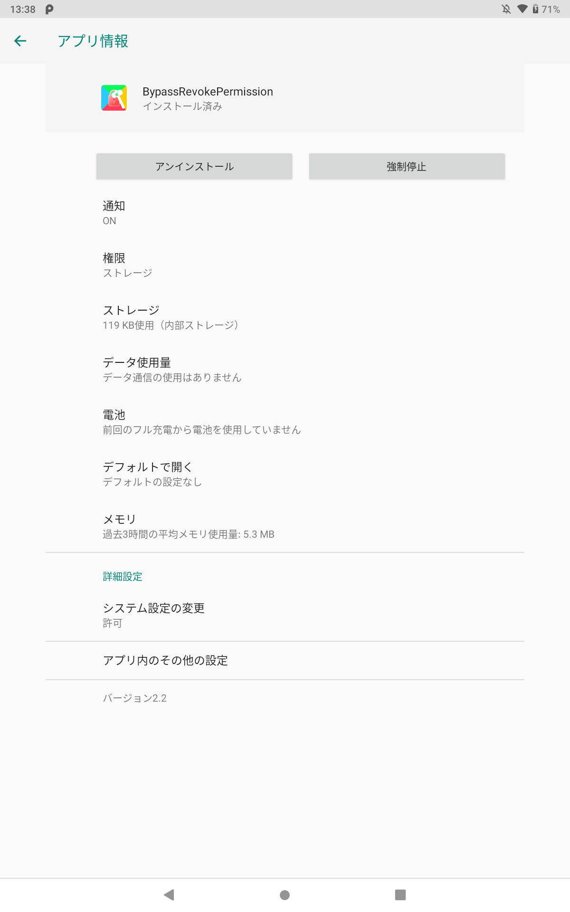

# BypassRevokePermission

このアプリケーションは標準のUIのまま Google Play ストアを使用できるようにします。

## 対応機種

- チャレンジパッド NEXT

## 動作要件

このアプリの動作には **DchaService** 以が必要です。

DchaServiceが無効化またはアンインストールされていると正常に動作しません。

> [!TIP]
> DchaServiceをアンインストールしている場合は、以下のコマンドをADBで実行してください。
> ```
> adb shell cmd package install-existing jp.co.benesse.dcha.dchaservice
> ```
 
## 注意事項

[CPadCustomizeTool](https://github.com/Kobold831/CPadCustomizeTool) の \[システムUIを通常用に維持\] の機能は**絶対に**使用しないでください。

このアプリケーションが正常に動作しなくなります。

CPadCustomizeTool 側での対応時期は未定です。

---

このアプリをインストールした場合は、必ずランチャーなどから**BypassRevokePermission**のアイコンを押してください。

\[**機能は有効になりました**\] と表示されれば問題ありません。

---

このアプリをアップデートした場合は、必ず以下の画像にある**アプリ内のその他の設定**を押してください。

設定→アプリと通知→◯個のアプリをすべて表示→BypassRevokePermission→**アプリ内のその他の設定**

システムUIが一瞬だけ変更されれば問題ありません。

<a href="#"></a>

## 不具合の対処法

このアプリを使用するときは以下にご留意ください。

- 症状

Google Play ストアがクラッシュする。

- 原因と対処法
  - ごく稀にプログラムが正しく動作しないために Google Play ストアがクラッシュします。

    最新バージョンではほとんど発生しませんが、技術上限界があるためご理解ください。

この問題が発生した場合、アップデート時と同じ修正方法を行ってください。

## 機能修正

バグや不具合が繰り返し発生する場合は、お手数ですが[報告](https://github.com/Kobold831/BypassRevokePermission/issues)のご協力をお願いいたします。

または開発者に直接報告をお願いします。

機能改善などの要望がある場合は開発者に直接報告をお願いします。
